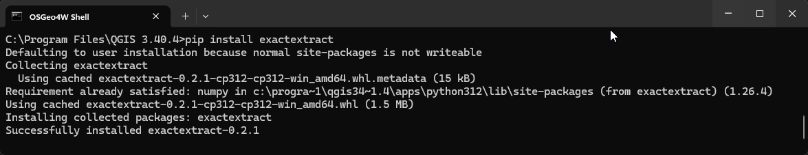
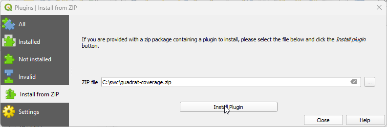
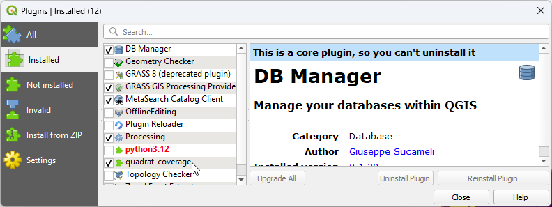
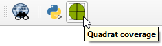
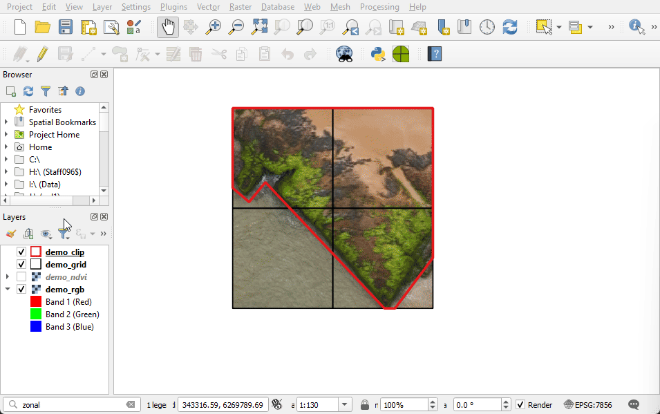
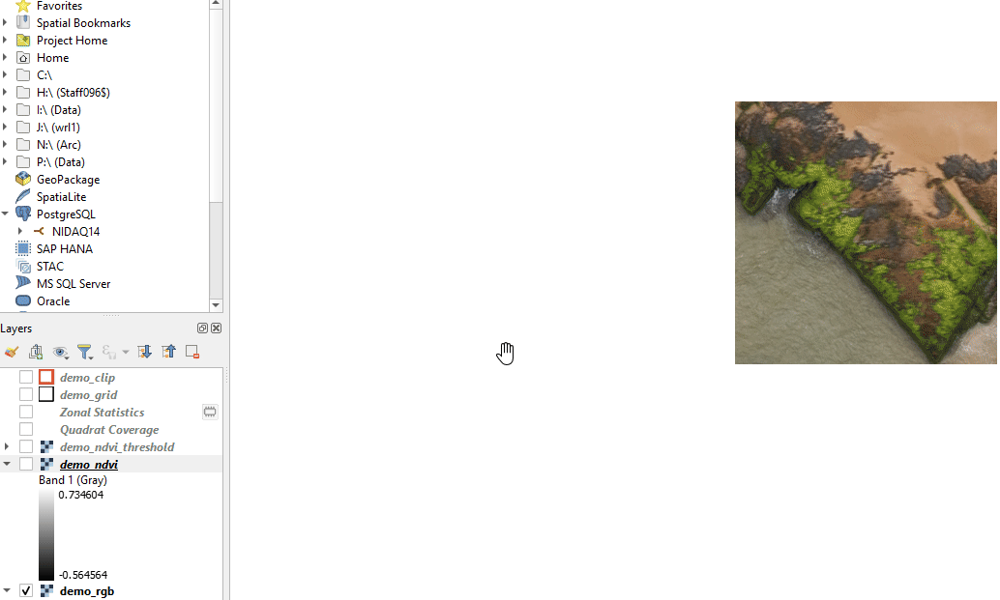
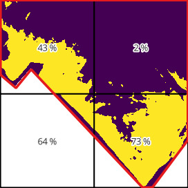
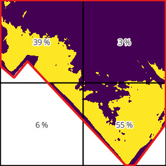

# quadrat-coverage

This package is designed to calculate the percent coverage of vegetation within
certain areas (quadrats). The vegetation information is taken from a single-band
raster image where the pixel values represent the non-dimensional vegetation
index (NDVI).


## Workflow

The workflow for calculating percent coverage is as follows:

1. Clip the input raster to remove unwanted regions, such as trees and ocean.
2. Classify the image into 'vegetation'/'non vegetation' using a threshold.
3. Calculate the percent of vegetation coverage for a grid of quadrats.

The following images illustrate the workflow.
| Image                                            | Description                                                            |
| ------------------------------------------------ | ---------------------------------------------------------------------- |
|               | RGB image                                                              |
|         | NDVI image (greyscale)                                                 |
|  | NDVI image (pseduocolour) with clipping mask                           |
|   | Classified/binary image after clipping (yellow pixels show vegetation) |
|      | Quadrats with percent vegetation coverage                              |

## Inputs

There are four inputs required for the calculation:

| Name          | Type                             | Description                                   |
| ------------- | -------------------------------- | --------------------------------------------- |
| NDVI image    | raster (e.g. tif)                | Single band input image of vegetated area     |
| Clipping mask | vector (e.g. shapefile, geojson) | Clipping polygon(s)                           |
| Quadrat grid  | vector (e.g. shapefile, geojson) | Quadrat polygons                              |
| Threshold     | Decimal value between -1 and +1  | Threshold value for vegetation classification |


## Installation

### exactextract

This package requires the `exactextract` library, which can be installed using `pip`.

1. Open the `OSGeo4W Shell`
2. Type the command: `pip install exactextract`



### QGIS plugin

Download the zip file from [https://github.com/onewhaleid/quadrat-coverage](https://github.com/onewhaleid/quadrat-coverage/archive/refs/heads/main.zip)

In QGIS, select 'Plugins' -> 'Manage and Install Plugins...' -> 'Install from ZIP'.



Then select 'Installed', and make sure the 'quadrat-coverage' plugin is ticked.




## Usage

### Graphical user interface

The plugin can be opened from the toolbar icon:



After selecting the inputs, a new vector results layer is added to the map:




### Command line tool

A command line tool is also available, which allows batch processing of multiple sites.

1. Open the `OSGeo4W Shell`
2. Navigate to correct directory, e.g.: `cd \path\to\quadrat-coverage`
3. Type the command: `python quadrat_coverage.py inputs.ini`

Where `inputs.ini` is a file containing the input parameters for each site.

```ini
[site-1]
threshold = 0.3                                               # ndvi threshold
raster_ndvi = C:\swc\quadrat-coverage\data\demo_ndvi.tif      # input image
vector_grid = C:\swc\quadrat-coverage\data\demo_grid.geojson  # quadrat polygons
vector_clip = C:\swc\quadrat-coverage\data\demo_clip.geojson  # clipping mask
vector_output = C:\swc\quadrat-coverage\output.geojson        # output file

[site-2]
threshold = 
raster_ndvi = 
vector_grid = 
vector_clip = 
vector_output = 

[site-3]
...
```

## Threshold value

An appropriate vegetation threshold value can be determined by iteratively changing the symbology settings of the NDVI layer in QGIS, with the RGB layer underneath.




## Motivation

QGIS already has a tool for calculating zonal statistics. Why is the `exactextract` package needed? QGIS's built in zonal statistics tool `zonalstatisticsfb` does not handle edge cases correctly, where the quadrat polygons include regions beyond the raster extent. 

In the example below, the QGIS zonal statistics tool reports 64% vegetation coverage in the lower left cell, because it is omitting the empty pixels outside the red clipping boundary. This value is clearly incorrect, because the majority of the cell is empty. In contrast, the `exactextract` package allows empty pixels to have a zero value (i.e. 'not vegetation') using the when calculating the percent coverage for the total cell area.


| Result                         | Source              | Comment                                                                              |
| ------------------------------ | ------------------- | ------------------------------------------------------------------------------------ |
|  | `zonalstatisticsfb` | Empty pixels are excluded (percent cover is overestimated).                          |
|      | `exactextract`      | Empty pixels are considered 'not vegetation'. Percent cover is calculated correctly. |

